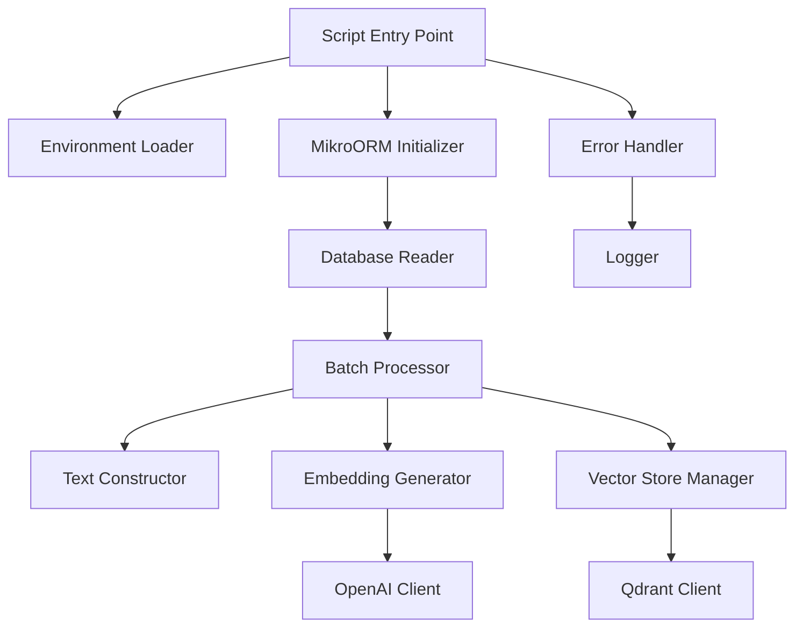

# Design Document: Catalog Embedding Script

## Overview

The catalog embedding script is a standalone TypeScript utility that generates vector embeddings for product listings in the TechBazaar marketplace. The script orchestrates a data pipeline that reads active product listings from MySQL, generates semantic embeddings using OpenAI's text-embedding-3-small model, and stores them in Qdrant vector database for semantic search capabilities.

The script is designed to be idempotent and re-runnable, allowing it to be executed periodically to keep the vector database synchronized with the product catalog. It processes listings in batches to respect API rate limits and handles partial failures gracefully to ensure maximum catalog coverage.

### Key Design Goals

- **Standalone Execution**: Runs independently without requiring the NestJS application to be running
- **Idempotency**: Can be re-run safely to update embeddings without data corruption
- **Resilience**: Continues processing even when individual batches or listings fail
- **Efficiency**: Batches API calls to minimize latency and respect rate limits
- **Observability**: Comprehensive logging for monitoring and troubleshooting

## Architecture

### High-Level Data Flow


### Component Architecture



### Execution Flow

1. **Initialization Phase**
   - Load environment variables from `.env.development`
   - Initialize MikroORM with database configuration
   - Connect to Qdrant and verify/create collection
   - Initialize OpenAI client

2. **Data Fetching Phase**
   - Query MySQL for active listings (status="Active", isDeleted=false)
   - Populate relations: brand, category, condition, item, listingSpecification, listingPrice
   - Log total count of listings to process

3. **Processing Phase**
   - Split listings into batches of 50
   - For each batch:
     - Construct descriptive text for each listing
     - Send batch to OpenAI API for embedding generation
     - Extract embeddings from response
     - Store embeddings with metadata in Qdrant
   - Log progress after each batch

4. **Cleanup Phase**
   - Close database connections
   - Log execution summary with total embeddings stored
   - Exit with appropriate status code

## Components and Interfaces

### 1. Script Entry Point

**File**: `src/scripts/embed-catalog.ts`

**Responsibilities**:
- Orchestrate the entire embedding generation process
- Handle top-level error catching and cleanup
- Manage script lifecycle (initialization, execution, cleanup)

**Function Signature**:
```typescript
async function main(): Promise<void>
```

### 2. Database Connection Manager

**Responsibilities**:
- Initialize MikroORM using existing configuration
- Provide EntityManager for database queries
- Ensure proper connection cleanup

**Interface**:
```typescript
interface DatabaseConnection {
  initialize(): Promise<MikroORM>;
  getEntityManager(): EntityManager;
  close(): Promise<void>;
}
```

**Implementation Details**:
- Reuse `MikroOrmConfigService` configuration
- Load environment variables using dotenv
- Handle connection errors with proper logging

### 3. Database Reader

**Responsibilities**:
- Fetch active listings with required relations
- Filter by status and deletion flag
- Return fully populated listing entities

**Function Signature**:
```typescript
async function fetchActiveListings(
  em: EntityManager
): Promise<Listing[]>
```

**Query Specification**:
```typescript
{
  where: {
    status: 'Active',
    isDeleted: false
  },
  populate: [
    'brand',
    'category',
    'condition',
    'item',
    'listingSpecification',
    'listingPrice'
  ]
}
```

### 4. Text Constructor

**Responsibilities**:
- Build natural language descriptions from listing fields
- Handle null/undefined fields gracefully
- Format prices with currency codes

**Function Signature**:
```typescript
function constructListingText(listing: Listing): string
```

**Text Format**:
```
{listingTitle} by {brandName}. {categoryName} in {conditionName} condition. 
Model: {modelTitle}. Processor: {processor}. RAM: {ramCapacity}. 
Storage: {primaryStorageCapacity} {primaryStorageType}[, {secondaryStorageCapacity} {secondaryStorageType}]. 
[Graphics: {graphicsCardName}.] [Screen: {screenSize} inches.] 
Price: {effectivePrice} {currencyCode}.
```

**Field Handling**:
- Omit fields that are null, undefined, 'ns', or '-1'
- Join multiple storage types with comma
- Include graphics and screen only if available
- Ensure non-empty output for all listings

### 5. Embedding Generator

**Responsibilities**:
- Generate embeddings using OpenAI API
- Process listings in batches of 50
- Handle API errors and retries
- Extract embedding vectors from responses

**Function Signature**:
```typescript
async function generateEmbeddings(
  texts: string[],
  batchNumber: number
): Promise<number[][]>
```

**Configuration**:
```typescript
{
  model: 'text-embedding-3-small',
  input: string[],
  encoding_format: 'float'
}
```

**Error Handling**:
- Log API errors with batch number
- Return empty array for failed batches
- Continue with next batch on failure

### 6. Vector Store Manager

**Responsibilities**:
- Manage Qdrant collection lifecycle
- Store embeddings with metadata
- Handle upsert operations for idempotency

**Interface**:
```typescript
interface VectorStoreManager {
  ensureCollection(): Promise<void>;
  upsertEmbeddings(points: VectorPoint[]): Promise<number>;
}

interface VectorPoint {
  id: number;
  vector: number[];
  payload: ListingMetadata;
}

interface ListingMetadata {
  listingId: number;
  listingTitle: string;
  brandName: string | null;
  categoryName: string;
  effectivePrice: number;
  currencyCode: string;
  listedQty: number;
  primaryImage: string;
  url: string | null;
}
```

**Collection Configuration**:
```typescript
{
  name: process.env.QDRANT_COLLECTION,
  vectors: {
    size: 1536,
    distance: 'Cosine'
  }
}
```

**Upsert Strategy**:
- Use listing ID as point ID for idempotency
- Convert effectivePrice string to number
- Handle individual upsert failures without stopping batch

### 7. Batch Processor

**Responsibilities**:
- Split listings into batches of 50
- Coordinate text construction, embedding generation, and storage
- Track progress and success metrics

**Function Signature**:
```typescript
async function processBatches(
  listings: Listing[],
  vectorStore: VectorStoreManager
): Promise<ProcessingResult>

interface ProcessingResult {
  totalProcessed: number;
  successfullyStored: number;
  failedBatches: number[];
}
```

**Processing Logic**:
1. Split listings into chunks of 50
2. For each batch:
   - Construct text for all listings
   - Generate embeddings via OpenAI
   - Map embeddings to listings
   - Prepare vector points with metadata
   - Upsert to Qdrant
   - Log progress
3. Return summary statistics

### 8. Logger

**Responsibilities**:
- Provide structured logging throughout execution
- Differentiate between info and error messages
- Include timestamps and context

**Interface**:
```typescript
interface Logger {
  info(message: string, context?: object): void;
  error(message: string, error?: Error, context?: object): void;
}
```

**Implementation**:
- Use `console.log` for informational messages
- Use `console.error` for error messages
- Include ISO timestamps
- Add contextual information (batch numbers, listing IDs, etc.)

## Data Models

### Listing Entity (Relevant Fields)

```typescript
interface Listing {
  listingId: number;
  listingTitle: string;
  listedQty: number;
  url: string | null;
  effectivePrice: string;
  primaryImage: string;
  status: ListingStatus;
  isDeleted: boolean;
  currencyCode: string;
  
  // Relations
  brand?: Brand;
  category: Categories;
  condition: Condition;
  item: Items;
  listingSpecification?: ListingSpecification;
  listingPrice?: ListingPrice;
}
```

### Items Entity (Relevant Fields)

```typescript
interface Items {
  itemId: number;
  brand: string;
  model: string;
  processor: string | null;
  ram: number | null;
  storageSsd: number | null;
  storageHdd: number | null;
  storageMobile: number | null;
}
```

### ListingSpecification Entity (Relevant Fields)

```typescript
interface ListingSpecification {
  id: number;
  ramCapacity: string;
  primaryStorageType: string;
  primaryStorageCapacity: string;
  secondaryStorageType: string;
  secondaryStorageCapacity: string;
  processor: string;
  graphicsCardName: string;
  screenSize: string;
}
```

### Environment Variables

```typescript
interface EnvironmentConfig {
  // Database
  DATABASE_HOST: string;
  DATABASE_PORT: number;
  DATABASE_USER: string;
  DATABASE_PASSWORD: string;
  DATABASE_NAME: string;
  
  // OpenAI
  OPENAI_API_KEY: string;
  
  // Qdrant
  QDRANT_URL: string;
  QDRANT_COLLECTION: string;
}
```

